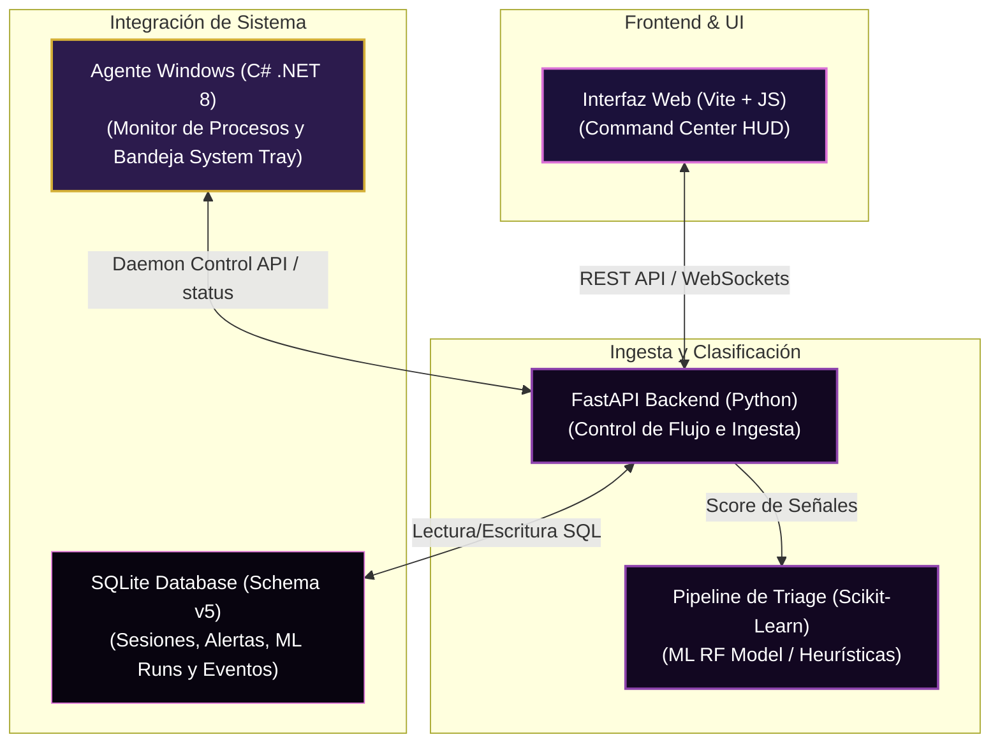
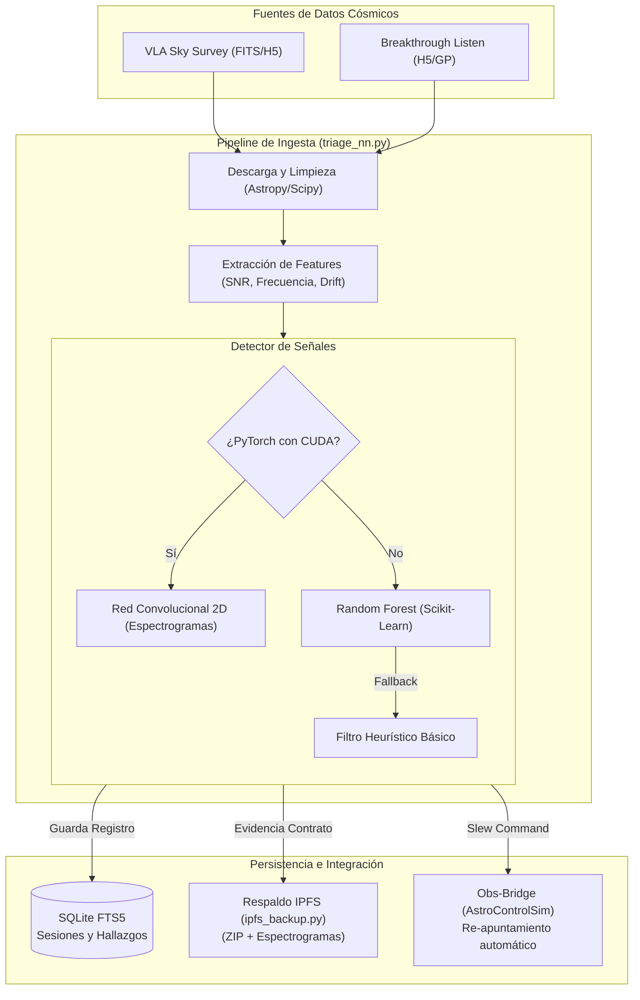

# OmniSky Miner 🛰️

> Estación autónoma de minería de datos cósmicos. Diseñada para buscar tecnofirmas (SETI) y anomalías astrofísicas de manera ininterrumpida las 24 horas, los 7 días de la semana.

---

## 🚀 Guía de Inicio Rápido

Para levantar toda la suite (API backend, demonio de fondo y la interfaz web) ejecuta el script unificado:

```powershell
# Levantar el stack completo
cd scripts
.\run_all.ps1
```

Una vez iniciado, abre tu navegador web en: **[http://127.0.0.1:8000](http://127.0.0.1:8000)**

---

## 🔬 Características de la Estación

### 1. Estación de Investigación (Research Station)
*   **Descubrimiento Multi-Fuente:** Conectores modulares a repositorios de datos astrofísicos reales como **VLASS** (VLA Sky Survey) y **Breakthrough Listen** (Green Bank / Parkes).
*   **Triage con Machine Learning (PyTorch CNN):** Clasificador avanzado mediante red convolucional 2D en `modules/triage_nn.py` (con fallback dinámico a heurísticas de bosque aleatorio si PyTorch no está instalado).
*   **Aceleración por GPU (CUDA/CuPy):** Auto-detección del hardware NVIDIA RTX e instalador inteligente de dependencias de aceleración matricial GPU en `scripts/install_gpu_deps.ps1`.
*   **Backups IPFS Descentrados:** Compresión de cascadas visuales, NPZ y metadatos en un archivo ZIP de evidencia que se publica de forma autónoma en la red descentralizada IPFS o gateways públicos (`modules/ipfs_backup.py`).
*   **Obs-Bridge Slew Follow-up:** Conexión en tiempo real (`modules/obs_bridge.py`) que escucha alertas críticas, traduce coordenadas astronómicas RA/DEC a Az/El locales y comanda al simulador `AstroControlSim` para re-apuntar las antenas automáticamente.
*   **Búsqueda Semántica:** Buscador de texto completo integrado mediante bases de datos SQLite FTS5 para agrupar reportes astrofísicos históricos.
*   **Agrupamiento Espacial (Clustering):** Algoritmo DBSCAN para detectar puntos calientes (hotspots) de señales sospechosas recurrentes en coordenadas celestes.
*   **Gamificación Científica:** Misiones de investigación interactivas con recompensas de XP para motivar al operador humano en el análisis visual.

### 2. Modo Demonio Inteligente (Daemon Mode)
*   Ejecución silenciosa en segundo plano con **Zero-Waste Policy** (Aprovechamiento al máximo de ciclos inactivos de CPU/GPU).
*   **Detección de Juegos/Apps Pesadas:** Pausa la minería automáticamente si abres juegos o software de renderizado intensivo para no afectar el rendimiento del PC.
*   Detecta procesos como: `GTA5.exe`, `Cyberpunk2077.exe`, `blender.exe`, `Adobe Premiere Pro.exe`, etc.
*   Instalación del agente como servicio de Windows:
    ```powershell
    .\scripts\install_service_windows.ps1
    ```

### 3. Centro de Comando Web (Command Center)
*   Dashboard moderno con HUD en tiempo real.
*   Explorador de eventos cósmicos y descargas.
*   Laboratorio de Audio: Generación de audio envolvente a partir de señales de radio (inmersión sonora) y espectrogramas interactivos.

### 4. Contrato de Evidencia (Evidence Contract)
Para asegurar la calidad científica, cada hallazgo verificado en la base de datos debe generar de forma estricta:
*   `annotated.png`: Firma visual / espectrograma anotado.
*   `evidence.json`: Metadatos técnicos (frecuencia, drift rate, SNR, coordenadas).
*   `report.md`: Análisis preliminar en Markdown formateado.

---

## 🏛️ Arquitectura del Sistema

El siguiente diagrama detalla cómo interactúan el agente Windows de escritorio en C#, la base de datos SQLite local, los módulos de análisis en Python y la interfaz web del operador:



### Pipeline de Triage y Flujo de Clasificación Machine Learning

El agente procesa señales continuas y las analiza para buscar candidatos a tecnofirmas siguiendo este flujo tecnológico:



---

## 🛠️ Requisitos e Instalación de Dependencias

El entorno ha sido completamente preparado y verificado en esta máquina:
*   **Python 3.11+:** Entorno virtual configurado en `venv/`.
*   **Dependencias Python:** Instaladas automáticamente (`streamlit`, `scikit-learn`, `astropy`, `scipy`, `pandas`, `plotly`, `fastapi`, `uvicorn`, entre otras).
*   **SDK .NET 8.0:** Instalado y utilizado para compilar el agente de bandeja en C#. *(Se solucionó el error de compilación CS7064 removiendo la referencia al icon físico ausente).*
*   **Node.js / npm:** Utilizado para compilar la interfaz de user en `ui/dist`.

---

## 🚦 Verificación y Pruebas del Sistema

Puedes correr la suite de verificación completa para auditar la integridad del sistema:

```powershell
# Habilitar codificación UTF-8 en PowerShell para visualizar emojis de reporte correctamente
$env:PYTHONIOENCODING = "utf-8"

# 1. Verificar base de datos e instalación básica
venv\Scripts\python.exe tests/verify_install.py

# 2. Verificar base de datos, migraciones (v1 a v5) y entrenamiento ML RandomForest
venv\Scripts\python.exe tests/verify_pro_features.py

# 3. Verificar el pipeline end-to-end de descarga, limpieza y triaje de files FITS/H5
venv\Scripts\python.exe tests/verify_run.py

# 4. Verificar síntesis de audio a WAV para análisis inmersivo de espectros
venv\Scripts\python.exe tests/verify_immersion.py

# 5. Verificar sensor de pausa por consumo y carga pesada (Daemon Engine)
venv\Scripts\python.exe tests/verify_daemon_pause.py
```

*Todos los scripts de verificación se ejecutan actualmente con un 100% de éxito (PASS).*

---
*OmniSky Miner es software libre enfocado en democratizar la investigación astrofísica amateur y la búsqueda de vida inteligente.*

<!-- Updated for 2026 active baseline maintenance -->
